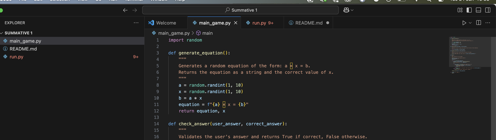

### **Equation Game Documentation ✨**

---

## **Introduction**

The Equation Game is an interactive, beginner-friendly terminal-based game designed to test and improve your math skills. The game generates simple multiplication equations, and your task is to solve for \(x\). Perfect for players of all ages, it’s a fun and engaging way to sharpen your mental maths!

---

## **User Guide**

The game challenges you with a series of equations in the form \(a × x = b\). Your goal is to find the value of \(x\). You'll receive instant feedback on your answers, and your score is tracked to see how well you did!

---

## **Features**

- **Randomly generated equations**: Every question is unique, ensuring endless fun!
- **Instant feedback**: Know right away if your answer is correct or incorrect.
- **Score tracking**: See your final score at the end of the game.
- **Error handling**: Invalid inputs won’t crash the game.

---

## **What You’ll Need**

1. Python 3.9 or later installed on your computer.
2. Access to a terminal or command prompt.

---

## **How to Play**

1. Run the game in your terminal by typing:
   ```bash
   python main.py
   ```
2. Solve the equations displayed on the screen, like:
   ```
   3 × x = 12
   ```
   Enter your answer for \(x\):  
   ```plaintext
   Your answer for x: 4
   ```
3. Repeat the process for all questions.
4. View your total score when the game ends.

---

## **Example Gameplay**

Here’s what it looks like:

```plaintext
Welcome to the Equation Game!

Question 1: 4 × x = 20
Your answer for x: 5
That's Right!

Question 2: 7 × x = 42
Your answer for x: 6
That's Right!

Question 3: 8 × x = 56
Your answer for x: 7
That's Right!

GAME OVER! Your total score is 3/3.
```

---

## **Tips for Beginners**

- Don’t worry if you get an answer wrong—the correct answer is displayed for you.
- Make sure to enter only numbers; invalid inputs like letters or symbols will prompt you to try again.

---

## **Customisation Ideas**

I did some research on how I can make the game even more exciting: Try these ideas:
- **Change the number range**: Adjust the `random.randint` values to create harder or easier equations.
- **Add more questions**: Modify the `total_questions` variable to increase the challenge.

---

## **Enjoy the Game! 🎉**

## **Technical Manual: Equation Game**

### **1. Purpose of the Code**
This Python code implements a simple interactive game where players solve randomly generated multiplication equations in the form of \(a × x = b\). The player provides their answer for \(x\), and the programme evaluates whether the answer is correct. The game tracks the player’s score over multiple questions and displays the total score at the end.

---

### **2. Code Breakdown**

#### **2.1 Importing Libraries**
```python
import random
```
- **Purpose**: The `random` module is used to generate random numbers for the equations.  
- **Why Random Numbers?**: It ensures that each game session is unique and challenging.

---

#### **2.2 Function: `generate_equation()`**
```python
def generate_equation():
    """
    Generates a random equation of the form: a × x = b.
    Returns the equation as a string and the correct value of x.
    """
    a = random.randint(1, 10)  # Random integer for coefficient (a)
    x = random.randint(1, 10)  # Random integer for the variable (x)
    b = a * x  # Calculate the result (b)
    equation = f"{a} × x = {b}"  # Format the equation as a string
    return equation, x  # Return the equation and the correct answer (x)
```

- **Purpose**: Creates a multiplication equation using two random integers, `a` and `x`. The result `b` is computed as \(a × x\).  
- **Output**: A tuple containing:
  - The equation as a formatted string (e.g., `"3 × x = 12"`).  
  - The correct value of \(x\).

---

#### **2.3 Function: `check_answer(user_answer, correct_answer)`**
```python
def check_answer(user_answer, correct_answer):
    """
    Validates the user's answer and returns True if correct, False otherwise.
    """
    return user_answer == correct_answer
```
- **Purpose**: Compares the user’s input (`user_answer`) with the correct solution (`correct_answer`).  
- **Output**: Returns `True` if the answers match, otherwise `False`.

---

#### **2.4 Function: `display_score(score, total_questions)`**
```python
def display_score(score, total_questions):
    """
    Displays the user's total score at the end of the game.
    """
    print(f"GAME OVER! Your total score is {score}/{total_questions}.")
```
- **Purpose**: Outputs the player's final score, showing the number of correct answers out of the total questions.

---

#### **2.5 Function: `main()`**
```python
def main():
    """
    Main function to run the game.
    """
    print("Welcome to the Equation Game!")
    total_questions = 3  # Total number of questions in the game
    score = 0  # Initial score

    for i in range(total_questions):  # Loop through the questions
        equation, correct_answer = generate_equation()  # Generate a random equation
        print(f"Question {i + 1}: {equation}")  # Display the equation

        try:
            user_answer = int(input("Your answer for x: "))  # Get user input
            if check_answer(user_answer, correct_answer):  # Validate the answer
                print("That's Right!")  # Correct feedback
                score += 1  # Increment the score
            else:
                print(f"This is incorrect! The correct answer was {correct_answer}.")  # Incorrect feedback
        except ValueError:
            print("Invalid input. Please enter a number.")  # Handle non-numeric input

    display_score(score, total_questions)  # Display the final score
```
- **Purpose**: This function orchestrates the entire game:
  - Welcomes the player.  
  - Loops through `total_questions` to ask questions and evaluate answers.  
  - Handles user input and errors gracefully.  
  - Displays the final score at the end.

---

### **3. Why Doesn’t This Code Return Decimal Points?**
The code exclusively works with **integers** because:  
1. **Random Integer Generation**:  
   - The `random.randint(1, 10)` function generates whole numbers only.  
   - This ensures that both \(a\) and \(x\) are integers.  

2. **Multiplication**:  
   - The calculation \(b = a × x\) produces an integer result as both \(a\) and \(x\) are integers.  

3. **Answer Checking**:  
   - The user is asked for an integer answer (`int(input(...))`).  
   - This means the programme cannot accept decimal inputs, ensuring answers remain whole numbers.  

---

### **5. Summary**
- **Code Purpose**: A fun game for solving multiplication problems.  
- **Key Features**: Random equation generation, user feedback, and score tracking.  
- **Strengths**: Clean structure, modular design, and beginner-friendly functionality.  
- **Limitations**: Only supports integer values.  
